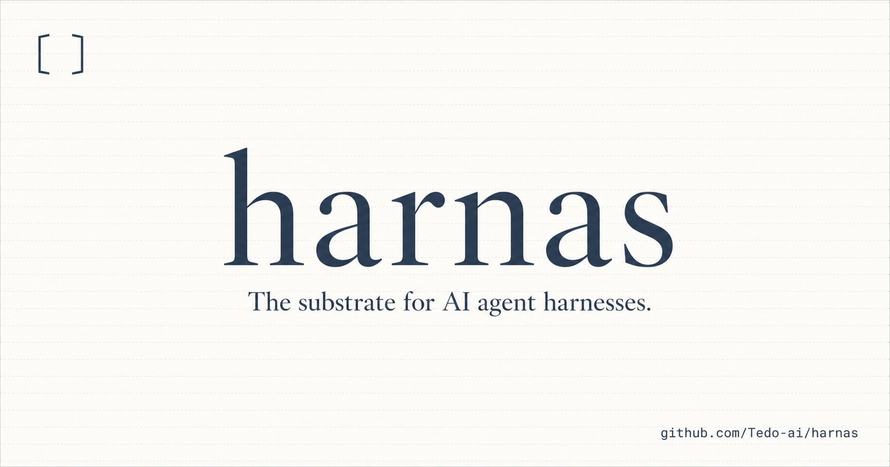

# Harnas

A spec-first, language-portable specification for LLM agent harnesses.
*(Pronounced HAR-nahs — Dutch for "harness".)*

This repository is the **specification itself**. Implementations live
in their own repositories; passing the conformance fixtures here is
what makes an implementation Harnas-conformant.

**Version 0.19.4** (released 2026-06-03). See
[`CHANGELOG.md`](CHANGELOG.md) for normative additions and fixture
coverage.

## What Harnas specifies

The coordination layer between a language model (or any provider that
answers model-shaped requests) and the surface a user or operator
interacts with. It sits above provider-specific APIs and below
application-level concerns like UI, orchestration, and policy.

The architectural commitment is small but specific: an **append-only
Log of typed Events** is the source of truth; provider request bodies
are pure **Projections** of that Log; provider responses are
**Ingested** back as more Events; reshaping (compaction, retraction,
supersession) happens via first-class **Mutation Events** that
reference earlier ones rather than modifying them.

## Reading order

1. [`00-conventions.md`](00-conventions.md) — RFC 2119 keywords,
   normative vs informative text, vocabulary, versioning.
2. [`01-overview.md`](01-overview.md) — the architectural frame: the
   layer picture, scope and out-of-scope, and the
   Log + Projections + Mutations model.
3. [`02-provider-contract.md`](02-provider-contract.md) — the
   wire-format contract every provider must honor.
4. [`04-tools.md`](04-tools.md), [`05-compaction.md`](05-compaction.md),
   [`07-permission.md`](07-permission.md) — Tools, Compaction,
   Permission contracts.
5. [`13-observation.md`](13-observation.md), [`14-hooks.md`](14-hooks.md),
   [`15-streaming.md`](15-streaming.md), [`16-actions.md`](16-actions.md),
   [`17-composition-rules.md`](17-composition-rules.md) — observation
   bus, hooks, streaming semantics, actions, composition rules.
6. [`18-agent-manifest.md`](18-agent-manifest.md) — declarative JSON
   manifest format. Two conformant implementations loading the same
   manifest must produce byte-identical Logs.
7. [`19-jsonl-persistence.md`](19-jsonl-persistence.md) — canonical
   Session JSONL persistence format for cross-language save/load.
8. [`20-production-embedding.md`](20-production-embedding.md) —
   recommended production embedding shape for web apps and services.
9. [`21-storage-adapters.md`](21-storage-adapters.md) — pluggable
   Session persistence laws, including `EventDraft` → `EventRow`.
10. [`23-conformance-runner.md`](23-conformance-runner.md) —
   conformance runner laws, strict artifact diffing, and oracle-corpus
   checks for the measurement system.
11. [`informative/`](informative/) — non-normative ecosystem
   conventions, including adopter helper surfaces, skills, MCP mapping
   guidance, multimodal content blocks, shell-tool embedding notes, provider implementation
   guidance, shell isolation guidance, conformance process,
   Log/Projection framing, subagent delegation, and worktree-per-agent
   runs.
12. [`strategies/`](strategies/) — per-strategy spec stubs (compaction
   and permission shipped in 0.1; more in 0.2+).
13. [`conformance/`](conformance/) — fixtures any conformant
   implementation must reproduce byte-for-byte.

## Implementations

| Language | Repo | Status |
|---|---|---|
| Ruby     | [Tedo-ai/harnas-ruby](https://github.com/Tedo-ai/harnas-ruby) | Reference implementation. 71/71 agent conformance fixtures, multimodal image/PDF content blocks, subagent delegation events and projections, reasoning capture/round-trip, Observation-only streaming deltas, round-trip persistence matrix, weekly live-provider liveness smoke (Anthropic, OpenAI, Gemini), local Ollama provider, builtin tools including normative `bash_session`, sandbox, guard, and credential strategies, full conformable surface. |
| Python   | [Tedo-ai/harnas-python](https://github.com/Tedo-ai/harnas-python) | 71/71 agent conformance fixtures, multimodal image/PDF content blocks, subagent delegation events and projections, reasoning capture/round-trip, Observation-only streaming deltas, round-trip persistence matrix, weekly live-provider liveness smoke (Anthropic, OpenAI, Gemini), local Ollama provider, builtin tools including normative `bash_session`, middleware, compaction, permissions, sandbox/guard/credential strategies, and CLI surface. |
| Go       | [Tedo-ai/harnas-go](https://github.com/Tedo-ai/harnas-go) | 71/71 agent conformance fixtures, multimodal image/PDF content blocks, subagent delegation events and projections, reasoning capture/round-trip, Observation-only streaming deltas, round-trip persistence matrix, weekly live-provider liveness smoke (Anthropic, OpenAI, Gemini), local Ollama provider, builtin tools including normative `bash_session`, middleware, compaction, permissions, sandbox/guard/credential strategies, and CLI surface. |
| TypeScript | [Tedo-ai/harnas-typescript](https://github.com/Tedo-ai/harnas-typescript) | 71/71 agent conformance fixtures across Node 20+, Bun, and Deno, with cross-language round-trip verification. Disclosed gaps before v1.0.0: fixture-aware implementations for MarkerTail tool-pair safety, manifest hooks, and fork/save-load handling; Windows `bash_session` behavior; receipt-only `spawn_agent`. |

A second implementation that passes every fixture under
[`conformance/agents/`](conformance/agents/) is, by the spec's
definition, conformant on those cases. The Ruby, Python, and Go
implementations are the current fully conforming reference set. TypeScript
is the fourth implementation under active hardening; it runs the suite but
has disclosed gaps that must close before it rejoins the conforming claim.
New ports in any language are welcome.

## License

[MIT](LICENSE).
